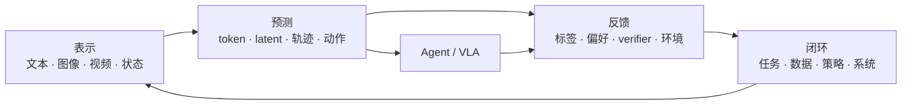

# AGI 能力地图

这张地图不把 AGI 当成单一分数，而把它拆成可以观察、复现和质疑的能力。

## 四个连接问题

每一个新模型都放回这四个问题中观察：

1. **表示**：它把什么压缩成可计算的内部状态？
2. **预测**：它预测的是下一个符号、完整分布，还是未来轨迹？
3. **反馈**：它如何知道自己错了？
4. **闭环**：反馈能否生成下一轮更好的任务、数据或策略？

这套语言允许你比较看似不同的工作：LLM 在 token 空间预测，扩散模型在 latent 空间去噪，VLA 在状态—动作空间预测，而自进化系统搜索的是实验和更新规则。

## 阅读路径

- 想理解基础机制：从 [Transformer 与语言建模](../tutorials/01-transformer.md) 开始。
- 想看历史因果：阅读[技术时间线](../timeline/)。
- 想判断最新进展：进入 [Frontier Radar](../radar/)。
- 想亲自验证：进入 [Experiments](../experiments/)。

