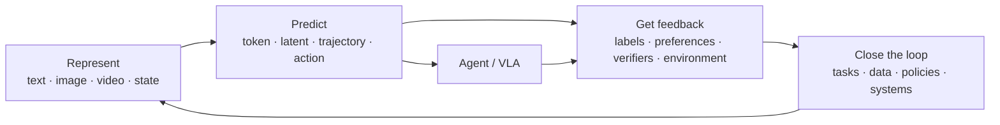

# AGI Capability Map

This map does not treat AGI as a single score. It decomposes the problem into capabilities that can be observed, reproduced, and challenged.

## Four connecting questions

Place every new model under the same four questions:

1. **Representation**: what does it compress into a computable internal state?
1. **Prediction**: does it predict the next symbol, a full distribution, or a future trajectory?
1. **Feedback**: how does it know that it is wrong?
1. **Closed loop**: can feedback produce better tasks, data, or policies for the next round?

This vocabulary makes seemingly different work comparable: LLMs predict in token space, diffusion models denoise in latent space, VLAs predict in state–action space, and self-improving systems search over experiments and update rules.

## Reading path

- To understand the core mechanism: start with [Transformer and language modeling](../tutorials/01-transformer.md).
- To recover historical causes: read the [Technology Timeline](../timeline/index.md).
- To assess current progress: open the [Frontier Radar](../radar/index.md).
- To test ideas yourself: open [Experiments](../experiments/index.md).
