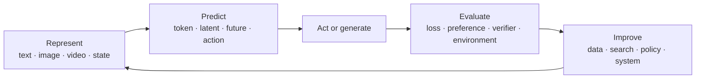

# 00 · Orientation: What Are We Trying to Explain?

## The question

This is not a chronological survey of fashionable models. It is a build-and-test path around one
working question:

> Can a system understand a new goal, build a useful model of its situation, plan and act over
> long horizons, learn from feedback, and improve with decreasing human supervision?

The historical order still matters, but only as causal context. We will use it to explain why the
field repeatedly expanded the thing being predicted:

```text
token → multimodal representation → future trajectory → action → experiments and improvement
```

## The map



Every tutorial changes one part of this loop. Every experiment asks whether the change survives a
controlled comparison and a failure-oriented evaluation.

## Five capability axes

We will track every method on these axes rather than collapse progress into one benchmark:

1. **Generalization** — new tasks, domains, and compositions.
2. **Long horizon** — persistent goals, state, and recovery over many steps.
3. **Grounding** — spatial, temporal, causal, and physical structure.
4. **Autonomous learning** — improvement from interaction and less task-specific labeling.
5. **Reliability and efficiency** — verifiability, control, latency, and cost.

These axes are an observation framework, not a complete definition of intelligence.

## How the series is organized

- **Phase I — Language:** scalable prediction, post-training, reasoning, memory.
- **Phase II — Perception:** visual representations, multimodal alignment, grounding.
- **Phase III — Generation:** diffusion, flow, video prediction, interactive world models.
- **Phase IV — Action:** agents, imitation learning, VLAs, planning, online adaptation.
- **Phase V — Improvement:** verifiers, synthetic data, discovery loops, safety.

See the [complete roadmap](roadmap.md) for prerequisites, experiments, and phase checkpoints.

## How to use the external material

The [Resource Library](../resources/index.md) is a set of external anchors, not a second syllabus.
For each phase, choose one serious course or implementation series, one primary paper, and one talk
or lecture sequence. We borrow proven pedagogy and assignments; the AGI questions, comparisons,
failure logs, and judgments remain specific to this repository.

## First action

Before Tutorial 01, write one paragraph in the
[Research Ledger](../radar/research-ledger.md): what do you currently believe is the main
constraint on AGI progress, what evidence supports it, and what would change your mind?

Then start with [01 · Transformer and Language Modeling](01-transformer.md).

## Completion check

You are ready to continue when you can explain why “a higher benchmark score” is not, by itself,
evidence for generalization, grounding, long-horizon agency, or self-improvement.
