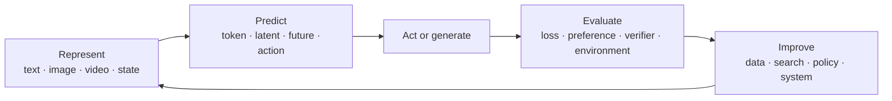

# Tutorials

The series is organized by capability bottlenecks, not by model-release chronology. One question
runs through every phase:

> Can a system understand a new goal, build a useful model of its situation, plan and act over
> long horizons, learn from feedback, and improve with decreasing human supervision?

Each page changes one part of this loop. A release earns a permanent row only when it changes a
durable concept or supplies a reproducible experiment. Model names that do neither belong in the
[Frontier Radar](../radar/index.md).

A page answers: what was missing, the minimal mechanism, one controlled comparison, where it fails,
the current judgment, and the next test. Experiments are optional; a page can ship before its
implementation exists.

## Phase I · Language

External anchors: [Stanford CS336](https://cs336.stanford.edu/),
[Karpathy — Zero to Hero](https://karpathy.ai/zero-to-hero.html),
[Hugging Face LLM Course](https://huggingface.co/learn/llm-course/chapter1/1).

| No. | Tutorial                                                               | Historical bottleneck                                                                            | Minimal experiment                                                                                                        |
| --- | ---------------------------------------------------------------------- | ------------------------------------------------------------------------------------------------ | ------------------------------------------------------------------------------------------------------------------------- |
| 01  | [Transformer and language modeling](01-transformer.md)                 | Recurrent sequence models were hard to parallelize and scale                                     | Train a tiny decoder-only Transformer; separate memorization from generalization                                          |
| 02  | Scaling laws, data, and compute                                        | A working architecture did not tell us how to allocate a training budget                         | Fit a small scaling curve under a fixed compute budget                                                                    |
| 03  | Supervised fine-tuning, preference optimization, and language-model RL | Pretraining did not directly optimize instruction following, human preferences, or task outcomes | Hold the base model and prompts fixed; compare SFT, direct preference optimization, and a small verifier-guided RL update |
| 04  | Reasoning, search, and test-time compute                               | A single forward sample was brittle on multi-step problems                                       | Hold the model fixed; vary sampling, search, and verifier budget                                                          |
| 05  | Retrieval, memory, and long context                                    | Parameters and context windows were poor substitutes for persistent memory                       | Compare parametric recall, retrieval, and explicit episodic memory                                                        |

Tutorial 03 follows the post-training signal from demonstrations through preference data and
outcome feedback. Treat specific algorithms as case studies; the durable question is what feedback
is available and how reward hacking can make an apparent gain misleading.

## Phase II · Perception

External anchors: [Stanford CS231n](https://cs231n.stanford.edu/),
[course notes](https://cs231n.github.io/).

| No. | Tutorial                                       | Historical bottleneck                                                           | Minimal experiment                                                                  |
| --- | ---------------------------------------------- | ------------------------------------------------------------------------------- | ----------------------------------------------------------------------------------- |
| 06  | Visual representation and contrastive learning | Language-only models had no direct perceptual grounding                         | Train a small CLIP-style model and inspect retrieval failures                       |
| 07  | Connector-based multimodal LLMs                | Image and language representations were not directly usable by one decoder      | Compare pooling, an MLP projector, and query tokens under a token budget            |
| 08  | Spatial, temporal, and document grounding      | Caption alignment did not imply precise perception or reasoning                 | Build adversarial tests for counting, spatial relations, OCR, and evidence citation |
| 09  | Native multimodal and omni models              | Separate encoders and objectives limited cross-modal generation and interaction | Compare discrete and continuous representations conceptually and empirically        |

## Phase III · Generation

External anchors: [Hugging Face Diffusion Course](https://huggingface.co/learn/diffusion-course/unit0/1),
[Stanford CS25](https://web.stanford.edu/class/cs25/).

**Open problem:** when does a video model become an interactive world model? Attractive video is
not enough; the tests are action-conditioned prediction, long-term state consistency, and whether
the state is useful for planning.

| No. | Tutorial                                  | Historical bottleneck                                               | Minimal experiment                                                      |
| --- | ----------------------------------------- | ------------------------------------------------------------------- | ----------------------------------------------------------------------- |
| 10  | VAE, score matching, and diffusion        | High-dimensional continuous generation was unstable or low fidelity | Train a toy diffusion model and visualize the denoising field           |
| 11  | Latent diffusion, DiT, and flow matching  | Pixel-space generation was expensive and difficult to scale         | Compare objectives and sampling cost on one small dataset               |
| 12  | Conditioning and controllability          | High-quality samples did not guarantee useful control               | Measure prompt, structural, and reference adherence separately          |
| 13  | Video generation and temporal consistency | Image models did not preserve state through time                    | Test object permanence, identity, causality, and long-horizon drift     |
| 14  | World models and interactive simulation   | Plausible video was not necessarily useful for planning             | Compare pixel, latent, and state prediction in a controlled environment |

## RL bridge

Complete this before Tutorials 16–18. Tutorial 03 covers RL as language-model post-training; this
bridge is the general machinery for agents, control, and embodied learning.

External anchors: [Berkeley Deep RL](https://rail.eecs.berkeley.edu/deeprlcourse/).

| Central question                                                                           | Minimal comparison                                                                                                                            |
| ------------------------------------------------------------------------------------------ | --------------------------------------------------------------------------------------------------------------------------------------------- |
| How should an agent improve decisions when actions change future observations and rewards? | In one small environment, compare behavior cloning, a model-free update, and model-based planning; diagnose shift and reward misspecification |

## Phase IV · Action

External anchors: [Hugging Face Agents Course](https://huggingface.co/learn/agents-course/unit0/introduction),
[Hugging Face Robotics Course](https://huggingface.co/learn/robotics-course).

**Open problem:** do VLAs need explicit long-term memory? Success on short tasks does not imply
success on tasks that span hours. Separate memory, state estimation, planning, and the action
policy.

| No. | Tutorial                                                           | Historical bottleneck                                                                                                                            | Minimal experiment                                                                                                         |
| --- | ------------------------------------------------------------------ | ------------------------------------------------------------------------------------------------------------------------------------------------ | -------------------------------------------------------------------------------------------------------------------------- |
| 15  | Tool-using agents                                                  | Models produced answers but could not reliably alter external state                                                                              | Build an agent with typed tools, traces, budgets, and recovery tests                                                       |
| 16  | Imitation learning, action representations, and diffusion policies | Language-model post-training and discrete token generation did not explain how to learn high-dimensional, multimodal actions from demonstrations | Hold the demonstration data fixed; compare behavior cloning with single-step, action-chunked, and diffusion-policy outputs |
| 17  | Vision–language–action models                                      | Robot policies did not transfer language and visual knowledge cleanly                                                                            | Train or adapt a small policy in simulation; evaluate task and embodiment shift                                            |
| 18  | Planning, memory, and online adaptation                            | Short demonstrations did not solve long-horizon recovery                                                                                         | Hold the policy fixed while varying planner, memory, and feedback                                                          |

Tutorial 16 stays on action representations and supervised policy learning. Do not turn it into a
second general RL survey.

## Phase V · Improvement

External anchors: [Full Stack Deep Learning](https://fullstackdeeplearning.com/) for evaluation
discipline, [Stanford CS25](https://web.stanford.edu/class/cs25/) for current disagreements.

**Open problems:** can verifiers replace large-scale human feedback? How can self-generated tasks
avoid distribution collapse? How can automated discovery prove that progress is real (independent
holdout, preregistered metrics, rollback, compute accounting)?

| No. | Tutorial                                  | Historical bottleneck                                           | Minimal experiment                                                            |
| --- | ----------------------------------------- | --------------------------------------------------------------- | ----------------------------------------------------------------------------- |
| 19  | Synthetic data and automatic curricula    | Human-generated training tasks did not scale indefinitely       | Generate tasks near the capability boundary and detect diversity collapse     |
| 20  | Verifiers and process supervision         | Self-generated outputs could not be trusted as their own labels | Measure verifier false positives, gaming, and held-out transfer               |
| 21  | Coding and research agents                | Tool use did not imply reliable multi-hour improvement          | Run an auditable propose–execute–evaluate–revise loop                         |
| 22  | Discovery loops and open-ended search     | Optimization remained confined to objectives designed by people | Search over a bounded method space with preregistered evaluation and rollback |
| 23  | Safety and epistemics of self-improvement | A stronger optimizer can exploit an incomplete evaluator        | Red-team the evaluator and define stop, audit, and containment conditions     |

## Three systems to reuse

Prefer extending these over starting 24 disconnected demos:

1. **Tiny foundation model** — begins as a decoder-only Transformer.
1. **Small interactive world** — begins as a predictable simulator.
1. **Auditable discovery loop** — begins as the [research ledger](../radar/research-ledger.md).

## Current sprint

1. Complete [01 · Transformer and Language Modeling](01-transformer.md).
1. Run [Experiment 001](https://github.com/charliememory/agi-frontier/tree/main/experiments/001-tiny-transformer)
    if you want a number behind the memorization-versus-composition claim.
1. Write one note in the [research ledger](../radar/research-ledger.md).
