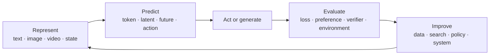

# Tutorial Roadmap

This roadmap follows historical causes inside each track while using one AGI question across
all tracks:

> Can a system understand a new goal, build a useful model of its situation, plan and act over
> long horizons, learn from feedback, and improve with decreasing human supervision?

The series is organized by **capability bottlenecks**, not by model-release chronology. The
timeline remains visible because each tutorial begins with what the previous paradigm could not
do and ends with the next unresolved bottleneck.

## The shared loop

Every tutorial changes one part of this loop and asks whether that change produces a genuine
capability gain.

## Phase 0 · Orientation

| No. | Tutorial                      | Central question                                               | Required artifact           |
| --- | ----------------------------- | -------------------------------------------------------------- | --------------------------- |
| 00  | [Orientation](00-overview.md) | What are we trying to explain, and how is the route organized? | First research-ledger entry |

## Phase I · Language models: scalable prediction and reasoning

| No. | Tutorial                                                               | Historical bottleneck                                                                            | Minimal experiment                                                                                                        |
| --- | ---------------------------------------------------------------------- | ------------------------------------------------------------------------------------------------ | ------------------------------------------------------------------------------------------------------------------------- |
| 01  | [Transformer and language modeling](01-transformer.md)                 | Recurrent sequence models were hard to parallelize and scale                                     | Train a tiny decoder-only Transformer; separate memorization from generalization                                          |
| 02  | Scaling laws, data, and compute                                        | A working architecture did not tell us how to allocate a training budget                         | Fit a small scaling curve under a fixed compute budget                                                                    |
| 03  | Supervised fine-tuning, preference optimization, and language-model RL | Pretraining did not directly optimize instruction following, human preferences, or task outcomes | Hold the base model and prompts fixed; compare SFT, direct preference optimization, and a small verifier-guided RL update |
| 04  | Reasoning, search, and test-time compute                               | A single forward sample was brittle on multi-step problems                                       | Hold the model fixed; vary sampling, search, and verifier budget                                                          |
| 05  | Retrieval, memory, and long context                                    | Parameters and context windows were poor substitutes for persistent memory                       | Compare parametric recall, retrieval, and explicit episodic memory                                                        |

**Phase checkpoint:** explain which gains came from training-time learning, which came from
test-time computation, and which came from external systems.

**Tutorial 03 scope:** follow the post-training signal from demonstrations through preference data
and outcome feedback. Separate SFT, learned-reward RLHF, direct preference objectives such as DPO,
and reinforcement learning from verifiable rewards. Treat specific algorithms as case studies; the
durable question is what feedback is available, where optimization happens, and how reward hacking
or distribution shift can make an apparent gain misleading.

## Phase II · Multimodal models: grounding symbols in perception

| No. | Tutorial                                       | Historical bottleneck                                                           | Minimal experiment                                                                  |
| --- | ---------------------------------------------- | ------------------------------------------------------------------------------- | ----------------------------------------------------------------------------------- |
| 06  | Visual representation and contrastive learning | Language-only models had no direct perceptual grounding                         | Train a small CLIP-style model and inspect retrieval failures                       |
| 07  | Connector-based multimodal LLMs                | Image and language representations were not directly usable by one decoder      | Compare pooling, an MLP projector, and query tokens under a token budget            |
| 08  | Spatial, temporal, and document grounding      | Caption alignment did not imply precise perception or reasoning                 | Build adversarial tests for counting, spatial relations, OCR, and evidence citation |
| 09  | Native multimodal and omni models              | Separate encoders and objectives limited cross-modal generation and interaction | Compare discrete and continuous representations conceptually and empirically        |

**Phase checkpoint:** determine whether each apparent reasoning failure is primarily a perception,
representation, reasoning, or evaluation failure.

## Phase III · Generative models: from samples to predictive worlds

| No. | Tutorial                                  | Historical bottleneck                                               | Minimal experiment                                                      |
| --- | ----------------------------------------- | ------------------------------------------------------------------- | ----------------------------------------------------------------------- |
| 10  | VAE, score matching, and diffusion        | High-dimensional continuous generation was unstable or low fidelity | Train a toy diffusion model and visualize the denoising field           |
| 11  | Latent diffusion, DiT, and flow matching  | Pixel-space generation was expensive and difficult to scale         | Compare objectives and sampling cost on one small dataset               |
| 12  | Conditioning and controllability          | High-quality samples did not guarantee useful control               | Measure prompt, structural, and reference adherence separately          |
| 13  | Video generation and temporal consistency | Image models did not preserve state through time                    | Test object permanence, identity, causality, and long-horizon drift     |
| 14  | World models and interactive simulation   | Plausible video was not necessarily useful for planning             | Compare pixel, latent, and state prediction in a controlled environment |

**Phase checkpoint:** state the evidence required before calling a generative video model a world
model.

## Core bridge · Reinforcement learning and sequential decision-making

Complete this bridge before Tutorials 16-18. Tutorial 03 covers reinforcement learning as a
language-model post-training method; this bridge develops the general machinery needed to reason
about agents, control, world models, and embodied learning.

| Central question                                                                           | Required scope                                                                                                                                               | Minimal comparison                                                                                                                                                                                   |
| ------------------------------------------------------------------------------------------ | ------------------------------------------------------------------------------------------------------------------------------------------------------------ | ---------------------------------------------------------------------------------------------------------------------------------------------------------------------------------------------------- |
| How should an agent improve decisions when actions change future observations and rewards? | MDPs; return and credit assignment; policy and value methods; model-free and model-based RL; offline and online learning; exploration; off-policy evaluation | In one small environment, hold the task and data budget fixed; compare behavior cloning, a model-free update, and model-based planning, then diagnose distribution shift and reward misspecification |

**Bridge checkpoint:** distinguish demonstration learning from reward-driven policy improvement;
explain when language-model RL, offline robot learning, online control, and planning share machinery
and when their data, exploration, and safety assumptions differ.

## Phase IV · Agents and VLAs: closing the perception–action loop

| No. | Tutorial                                                           | Historical bottleneck                                                                                                                            | Minimal experiment                                                                                                         |
| --- | ------------------------------------------------------------------ | ------------------------------------------------------------------------------------------------------------------------------------------------ | -------------------------------------------------------------------------------------------------------------------------- |
| 15  | Tool-using agents                                                  | Models produced answers but could not reliably alter external state                                                                              | Build an agent with typed tools, traces, budgets, and recovery tests                                                       |
| 16  | Imitation learning, action representations, and diffusion policies | Language-model post-training and discrete token generation did not explain how to learn high-dimensional, multimodal actions from demonstrations | Hold the demonstration data fixed; compare behavior cloning with single-step, action-chunked, and diffusion-policy outputs |
| 17  | Vision–language–action models                                      | Robot policies did not transfer language and visual knowledge cleanly                                                                            | Train or adapt a small policy in simulation; evaluate task and embodiment shift                                            |
| 18  | Planning, memory, and online adaptation                            | Short demonstrations did not solve long-horizon recovery                                                                                         | Hold the policy fixed while varying planner, memory, and feedback                                                          |

**Phase checkpoint:** separate perception, planning, control, data-coverage, and recovery errors in a
failed trajectory.

**Tutorial 16 scope:** focus on how action representations and supervised policy learning affect
continuous control. Use the RL bridge for policy optimization, exploration, and online learning;
do not turn Tutorial 16 into a second general reinforcement-learning survey.

## Phase V · Self-improving systems: from feedback to discovery

| No. | Tutorial                                  | Historical bottleneck                                           | Minimal experiment                                                            |
| --- | ----------------------------------------- | --------------------------------------------------------------- | ----------------------------------------------------------------------------- |
| 19  | Synthetic data and automatic curricula    | Human-generated training tasks did not scale indefinitely       | Generate tasks near the capability boundary and detect diversity collapse     |
| 20  | Verifiers and process supervision         | Self-generated outputs could not be trusted as their own labels | Measure verifier false positives, gaming, and held-out transfer               |
| 21  | Coding and research agents                | Tool use did not imply reliable multi-hour improvement          | Run an auditable propose–execute–evaluate–revise loop                         |
| 22  | Discovery loops and open-ended search     | Optimization remained confined to objectives designed by people | Search over a bounded method space with preregistered evaluation and rollback |
| 23  | Safety and epistemics of self-improvement | A stronger optimizer can exploit an incomplete evaluator        | Red-team the evaluator and define stop, audit, and containment conditions     |

**Phase checkpoint:** demonstrate an improvement that survives an independent holdout, a fixed
compute accounting, a baseline comparison, and an adversarial evaluator audit.

## Three cumulative projects

The course should not become 24 disconnected demos. Reuse three systems throughout:

1. **Tiny foundation model** — begins as a decoder-only Transformer, then gains post-training,
    retrieval, visual inputs, and verifier-guided inference.
1. **Small interactive world** — begins as a predictable simulator, then supports video/state
    modeling, planning, continuous actions, memory, and recovery.
1. **Auditable discovery loop** — begins as an experiment ledger, then proposes hypotheses,
    launches bounded experiments, evaluates results, and updates beliefs without touching the
    independent holdout.

## Scope rule

A release enters the roadmap only when it changes a durable concept, provides evidence against a
current bottleneck, or supplies a reproducible experiment. Model names that do none of these
belong in the monthly radar, not in the permanent curriculum.
